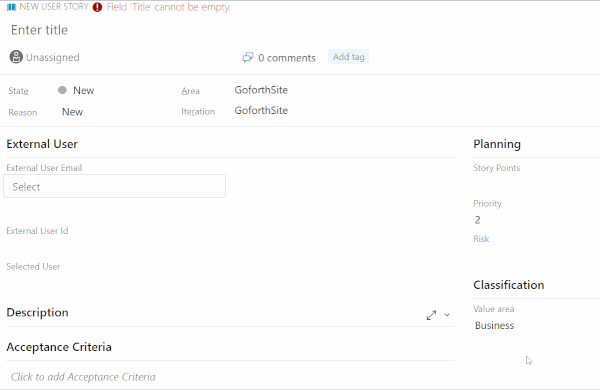
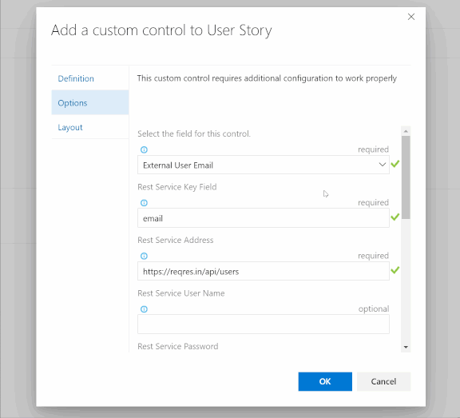

Get REST data and pick from a type-ahead filtering picklist with the option to map additional data back to your work item.



Use this with the ServiceNow table api, or any other Rest API.

You can now use basic auth by adding the username and password, or use token authentication by using the username "Bearer", and use the token in the password field

For Azure DevOps rest calls, you can also use the username 'Basic' with the PAT in the password field

The rest data that is returned can be used to automatically update other fields in the work item.
Use the field mapping configuration illustrated below to map fields from the rest service to field names in Azure DevOps

Sample Rest Response from which you want to extract a picklist.
```
{
    "page": 2,
    "per_page": 6,
    "total": 12,
    "data": [
        {
            "id": 7,
            "email": "michael.lawson@reqres.in",
            "first_name": "Michael",
            "last_name": "Lawson",
        },
        {
            "id": 8,
            "email": "lindsay.ferguson@reqres.in",
            "first_name": "Lindsay",
            "last_name": "Ferguson",
        }
    ]
}
```

Sample Settigns for Calling this Service

- Rest Service Key Field ```email```
- JSON Path to the Array ```data```
- Rest Call URL parameters ```{ "page":"2" }```
- FieldMap ```{ "Custom.ExternalUserId" : "id", "Custom.SelectedUser" : "first_name" }```



'Custom.' are custom field names in Azure DevOps, use the fields names that you want data from the rest service mapped to.

You may have to Add https://dedac.gallerycdn.vsassets.io to the CORS allowed domains on the rest service that you are calling to use the extension.  This isn't necessary for calling back into the Azure DevOps API

